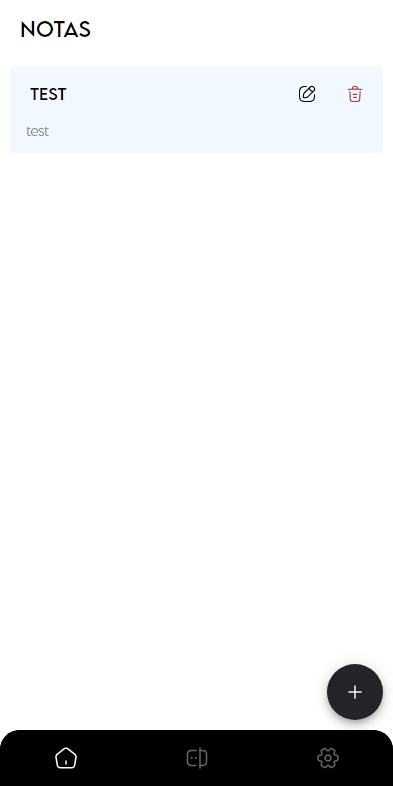

# Aplicación de notas y contraseñas con bloqueo biométrico

Esta es una aplicación desarrollada con Ionic, Angular y Capacitor, que permite guardar notas y contraseñas en Firebase y utilizar bloqueo biométrico para asegurar la privacidad de la información almacenada.

[Version Desktop]()





## Requisitos previos

Antes de comenzar a utilizar la aplicación, se necesitan los siguientes requisitos previos:

- Node.js
- Ionic CLI
- Angular CLI
- Capacitor CLI
- Instalación y configuración
- Para instalar y configurar la aplicación, siga estos pasos:

1. Clone este repositorio.

2. Abra una terminal en la carpeta raíz del proyecto y ejecute el siguiente comando para instalar las dependencias:

```sh
npm install
```

3. Cree una cuenta en Firebase y cree un proyecto.
4. En el panel de Firebase, agregue una aplicación web y copie las credenciales de Firebase.
5. Cree un archivo environment.ts en la carpeta src/environments y agregue las siguientes líneas de código:

```sh
export const environment = {
  production: false,
  firebase: {
    apiKey: '<tu_api_key>',
    authDomain: '<tu_auth_domain>',
    databaseURL: '<tu_database_url>',
    projectId: '<tu_project_id>',
    storageBucket: '<tu_storage_bucket>',
    messagingSenderId: '<tu_messaging_sender_id>',
    appId: '<tu_app_id>'
  }
};
```

Reemplace los valores entre <> con las credenciales de Firebase que copió anteriormente.

6. Ejecute el siguiente comando para agregar las plataformas iOS y Android:

```sh
ionic capacitor add ios
ionic capacitor add android
```

7. Ejecute el siguiente comando para abrir el proyecto en Xcode (para iOS):

```sh
ionic capacitor open ios
```

8. En Xcode, configure la firma del código de la aplicación y ejecute la aplicación en un simulador o en un dispositivo conectado.

9. Para Android, ejecute el siguiente comando para abrir el proyecto en Android Studio:

```sh
ionic capacitor open android
```

10. En Android Studio, configure la firma del código de la aplicación y ejecute la aplicación en un simulador o en un dispositivo conectado.

11. Para ejecutar la aplicación en un servidor local utilizando el comando ionic serve.

```sh
ionic serve
```

El servidor de desarrollo se iniciará y la aplicación se abrirá en el navegador web predeterminado. En la terminal se mostrará la URL del servidor local y el puerto donde se está ejecutando la aplicación. Por ejemplo:

```sh
Local: http://localhost:8100
```

## Uso de la aplicación

Una vez que la aplicación está instalada y configurada, se puede utilizar para guardar notas y contraseñas de forma segura. Además, la aplicación utiliza bloqueo biométrico para garantizar la privacidad de la información almacenada.

Para utilizar la aplicación, siga estos pasos:

1. Abra la aplicación en su dispositivo.
2. En la pantalla principal, seleccione "Notas" o "Contraseñas" según el tipo 1. de información que desea almacenar.
3. Toque el botón "+" para agregar una nueva nota o contraseña.
4. Ingrese el título y el contenido de la nota o la contraseña.
5. Toque el botón "Guardar (✔️)".
6. Si su dispositivo es compatible con bloqueo biométrico, puede activarlo en la pestaña de configuraciones (probado solo en android). Se solicitara cada vez que se inicie la aplicacion

## Contribución

Si desea contribuir a este proyecto, puede hacerlo siguiendo estos pasos:

1. Haga un fork del repositorio.
2. Clone el repositorio en su máquina local.
3. Cree una rama para su nueva función o corrección de errores.
